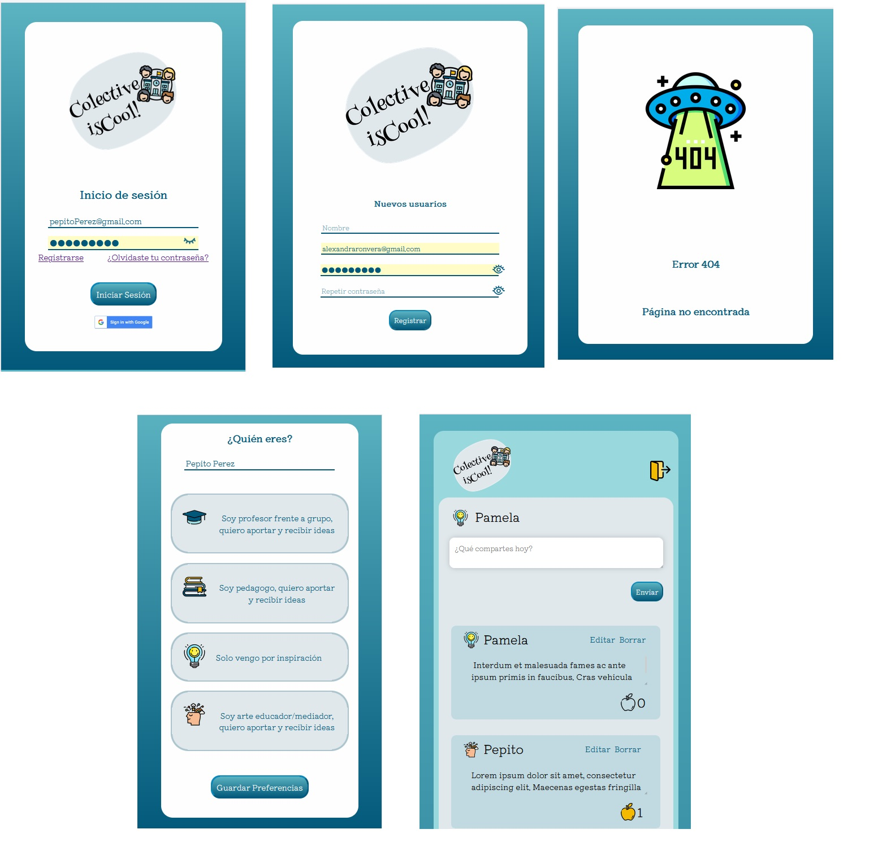

# Colective Is-Cool (Red Social)

## Índice
* [1. Preámbulo](#1-preámbulo)
* [2. Resumen del proyecto](#2-resumen-del-proyecto)
* [3. Diseño del producto](#3-diseño-de-producto)
* [4. Historias de usuario y funcionalidades](#4-historias-de-usuario-vistas-y-funcionalidades)
* [5. Aspectos técnicos](#5-aspectos-técnicos)
* [6. Pruebas unitarias](#6-resultado-de-los-test-jest)
* [5. Pruebas UX](#7testeo-con-usuarios-ux) 

## 1. Preámbulo

Instagram, Snapchat, Twitter, Facebook, Twitch, Linkedin, etc. Las redes sociales han invadido nuestras vidas. Las amamos u odiamos, y muchos no podemos vivir sin ellas.

¿Porqué son tan atractivas? Bueno, son una combinación de varios ingredientes que responden a algunas de las necesidades psicológicas más básicas: Ser entretenidos, ser inspirados, pertenecer a un grupo o sociedad,  y satisfacer nuestra curiosidad.

Está comprobado, por ejemplo, que los likes de nuestros amigos disparan estimulos de placer en nuestro cerebro, conocidos como "neuro-recompensas", que funcionan como pequeñas dosis de los mismos químicos que liberamos cuando sentimos que somos queridos o apreciados. Para nuestro cerebro, un "like", es aceptación social inmediata.... lo que probablemente nos llevará a publicar mas contenido similar.   

Como sabe cualquier influencer moderno, los mejores contenidos van a ser aquellos que planteen cosas que diviertan, inspiren, eduquen o informen a sus audiencias sobre los temas que a estas les sean mas interesantes. 

Es por esto que como programadoras nos preguntamos: ¿Que red social falta? En instagram están los fotógrafos, en pinterest los artistas plásticos, en Twitter -ahora "X"- están los periodistas.... ¿Quienes pueden necesitar una red social para compartir ideas y proyectos que los lleven a ser mejores profesionales, a inspirarse e inspirar a otros? La respuesta fue obvia ¡Los docentes! Los que trabajan en el aula, con niños y adultos, y que constantemente están buscando nuevas ideas que aplicar.

## 2. Resumen del proyecto

"Colective Is-cool" es una red social para profesores en donde se comparten recursos didácticos para la aplicación del arte y la tecnología en las aulas escolares. (Pensando en el marco de la educación STEM)

Está dirigida a:  

* Arte educadores, mediadores de artes, guias educativos, pedagogos, psicólogos, profesores de educación formal e informal.

* Especialistas en tecnologías aplicadas a la educación, que puedan diseñar materiales de mediación, los cuales puedan ser implementados en el aula.

El proyecto busca que sus usuari@s puedan:

* Tener una comunicación cercana con especialistas y colegas relacionados con el ámbito del arte, educacion y tecnologia.

* Poder compartir ideas entre colegas para la implementación, evaluación y creación de proyectos multidisciplinarios en sus aulas.

### 3. Diseño de producto. 

* "Colective Is-Cool" es una [Single-page Application (SPA)](https://es.wikipedia.org/wiki/Single-page_application)
[_responsive_](https://curriculum.laboratoria.la/es/topics/css/02-responsive) (con más de una vista / página)

* Esté desarrollada de tal forma que responde a las necesidades de responsividad a distintas vistas, dependiendo de si el/la usuari@ accede a la red desde su computadora, tablet o móvil.   

Tamaños disponibles: 

   * Laptop o Pc: (max-width: 1275px, 1215px, 1200px, 1110px)
   * Tablet : (max-width: 1024px, 935px, 870px, )
   * Mobile: (max-width : 770px, 670px, 575px, 450px, 360px)

* Para su diseño escogimos una paleta de colores azules con acentos en amarillo, que busca generar tranquilidad y confianza en los usuarios.
  
  

   Siendo una red artistica era probable que los usuarios usaran colores muy variados en sus post -obviamente, en versiones futuras de la interfaz - y por ello, escogimos un diseño plano y sencillo que no compitiera en colores o formas con esas futuras publicaciones. 

* Posee 7 pantallas en total: 3 principales (login, preferencias, y timeline), y 4 auxiliares (registro de nuevo usuario, error y recuperar contraseña). 

  

* Para manejar la data tanto de los usuarios como de los posts se utilizó Firebase, un servicio de base de datos y autenticación externo, gratuito y propiedad de Google. 

* Para comprobar, que nuestra aplicación funciona correctamente, se aplicaron una serie de pruebas unitarias con base en el entorno de Jest. 

### 4. Historias de usuario 

  ## Fase de Login

* 1. _Creación de cuenta de usuario nuevo_
    Creación de cuenta de acceso  con cuenta de correo y contraseña.

    * Validaciones:
    - Uso de correo electrónico válido.
    - Correo de verificación de correo electrónico.
    - Que no se repitan usuarios con el mismo correo.
    - Lo que se escriba en el campo (_input_) de contraseña debe ser secreto.
    - Que todos los campos estén llenos antes de enviar el formulario. 

* 2._Login con Google_ :
    Autenticación con google.

    * Validaciones:
    - Solamente se permite el acceso a usuarios con cuentas válidas.
    - No pueden haber usuarios repetidos.
    - La cuenta de usuario debe ser un correo electrónico válido.
    - Lo que se escriba en el campo (_input_) de contraseña debe ser secreto.
    
* 3 _Login con Firebase_ :
    Autenticación con cuenta de correo y contraseña.

  * Validaciones:
    - Solamente se permite el acceso a usuarios con cuentas válidas.
    - No pueden haber usuarios repetidos.
    - La cuenta de usuario debe ser un correo electrónico válido.
    - Lo que se escriba en el campo (_input_) de contraseña debe ser secreto.

* 3.1. _Recuperar contraseña_ :

    - Mostrar botón de recuperar contraseña debajo del formulario de login
    - Validar que el correo sea el correcto y enviar un mensaje de cambio de contraseña
    - Enviar al correo una url de recuperar contraseña.
    - La url te debe presentar un input donde puedas ingresar tu nueva constraseña y confirmarla debajo, las dos deben coincidir.
    - Al momento de recuperar la contraseña te retorna a la vista de login.

  ## Muro/ TimeLine

  * 4. _Crear post_ :
    - Al publicar, se debe validar que exista contenido en el _input_.
    - Poder ver el post publicado en el TL junto con el de los usuarios. 
    - Que los post se muestren en orden del tiempo de publicación.
    - Al recargar la aplicación, se debe verificar si el usuario está _logueado_
    
  * 5. _Borrar post_ :
    - Poder eliminar un post específico.
    - Pedir confirmación antes de eliminar un _post_.
    - Al recargar la página ya no debe aparecer el post.
    - Que solamente el usuario que creó el post pueda borrarlo.

  * 6. _Editar post_ :
    - Al dar _click_ para editar un _post_, debe cambiar el texto por un _input_ que permita editar el texto y luego guardar los cambios.
    - Al guardar los cambios debe cambiar de vuelta a un texto normal pero con la información editada.
    - Al recargar la página debo de poder ver los textos editados.
    - Que solamente el usuario que creó el post pueda editarlo.

  * 7. _Dar like al post_ :
    - Que los post tengan el espacio para darle like y se muestre inactivo
    - Que al presionar el icono de like se active
    - Que se muestre el conteo de likes
    - Poder quitar like y desactivarlo al dar clik
    - Un solo like por usuario

  * 8. _Cerrar Sesión_ :
    - Presentar un botón que me permita cerrar sesión.
    - Al momento de dar click me retorne al de inicio de sesión
    - Validar seguridad de las url solo se puede tener acceso cuando estas login

### 5. Aspectos técnicos.

Este proyecto es el resultado de las practicas profesionales de tres nuevas programadoras FrontEnd, formadas en el Bootcamp regional de Laboratoria:    Ketzali Arreola (México) , Saharai Rodríguez (México) y Alexandra Ron (Chile). 

Se ejecutó en un total de 6 sprints de una semana cada uno. Totalmente en vanilla Javascript (ES6+), HTML y CSS. No nos estuvo permitido el uso de frameworks o librerias, de ningún tipo.

El boiler plate quedó de la siguiente forma:

```text
./
├── .eslintrc 
├── .gitignore
├── .babelrc
├── .explaindev.json
├── .jest.config.js
├── .package-lock.json
├── .package.json
├── .README.md
├── .stylelint.config.js
├── .vite.config.js
├── .vscode
│   ├── ...
└── coverage
    ├── ...  
├── node-modules
    ├── ... 
└── src
    ├── .index.html
    ├── .main.js
    ├── .style.css
    ├── .assets
 	├── ...
    └── .components
 	├── .db
	├── .error
	├── .firebase
	├── .firestoreDelete
	├── .firestoreEdit
	├── .firestoreRecover
	├── .likes
	├── .login
	├── .newUserForm
	├── .postCreate
	├── .preferences
	├── .recover
	├── .resetPassword
	├── .TimeLine
     ├── .img
	├── ...
     ├── .test
	 ├── .create.spec.js
	 ├── .delete.spec.js
	 ├── .firestoreEdit.spec.js
	 ├── .login.spec.js
	 ├── .delete.spec.js
	 ├── .newUserForm.spec.js
	 ├── .delete.spec.js
	 ├── .preferences.spec.js
	 ├── .recover.spec.js

   ```

*** Nota: Las carpetas señaladas con "..." contienen imágenes o archivos autogenerados por las instalaciones del proyecto que no fueron modificados por las programadoras. 

### 6. Resultado de los test Jest.

Se nos exigía que los tests unitarios debían cubrir las funcionalides relacionadas a crear, editar, y borrar los post. 

```text
---------------|---------|----------|---------|---------|-------------------
File           | % Stmts | % Branch | % Funcs | % Lines | Uncovered Line #s 
---------------|---------|----------|---------|---------|-------------------
All files      |     100 |      100 |     100 |     100 |                   
 db.js         |     100 |      100 |     100 |     100 |                   
 firebase.js   |     100 |      100 |     100 |     100 |                   
 ...eDelete.js |     100 |      100 |     100 |     100 |                   
 ...oreEdit.js |     100 |      100 |     100 |     100 |                   
---------------|---------|----------|---------|---------|-------------------
Test Suites: 0 failed, 7 passed, 7 total
Tests:       0 failed, 11 passed, 11 total
Snapshots:   0 total
Time:        4.839 s
Ran all test suites.
 ```

### 7.Testeo con usuarios UX.

Aqui los resultados de gente probando la app. Y sus opiniones. 
